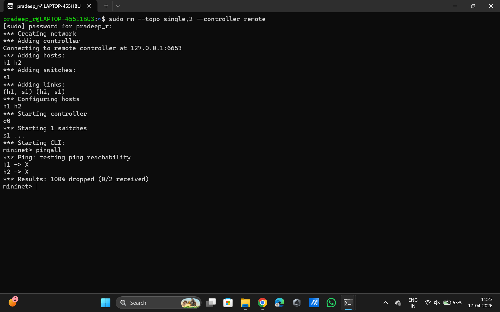
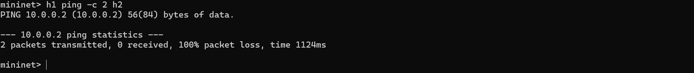

# 🚫 Packet Drop Simulator using SDN (Ryu + Mininet)

## 📌 Overview

This project demonstrates Software Defined Networking (SDN) using the Ryu controller and Mininet.
It blocks ICMP (ping) traffic between hosts using OpenFlow rules.

---

## 🎯 Objective

* Simulate a network using Mininet
* Control traffic using Ryu SDN controller
* Drop ICMP packets (ping)
* Demonstrate SDN centralized control

---

## 🛠️ Technologies Used

* Python
* Ryu Controller
* Mininet
* OpenFlow

---

## ⚙️ How to Run

### 1. Activate Environment

```
source ryu-env310/bin/activate
```

### 2. Set Path

```
export PYTHONPATH=$(pwd)/ryu
```

### 3. Run Controller

```
python ryu/bin/ryu-manager packet_drop.py
```

### 4. Run Mininet (New Terminal)

```
sudo mn --topo single,2 --controller remote
```

### 5. Test

```
pingall
```

---

## ✅ Output

```
*** Results: 100% dropped (0/2 received)
```

---

## 📸 Screenshots

### Controller Output



### Ping Result



---

## 🧠 Working

The controller installs a high-priority rule:

* Matches ICMP packets
* Drops them (no actions)

---

## 🚀 Conclusion

This project shows how SDN can control network behavior by blocking specific traffic like ICMP using centralized logic.

---

## 👨‍💻 Author

Pradeep R

